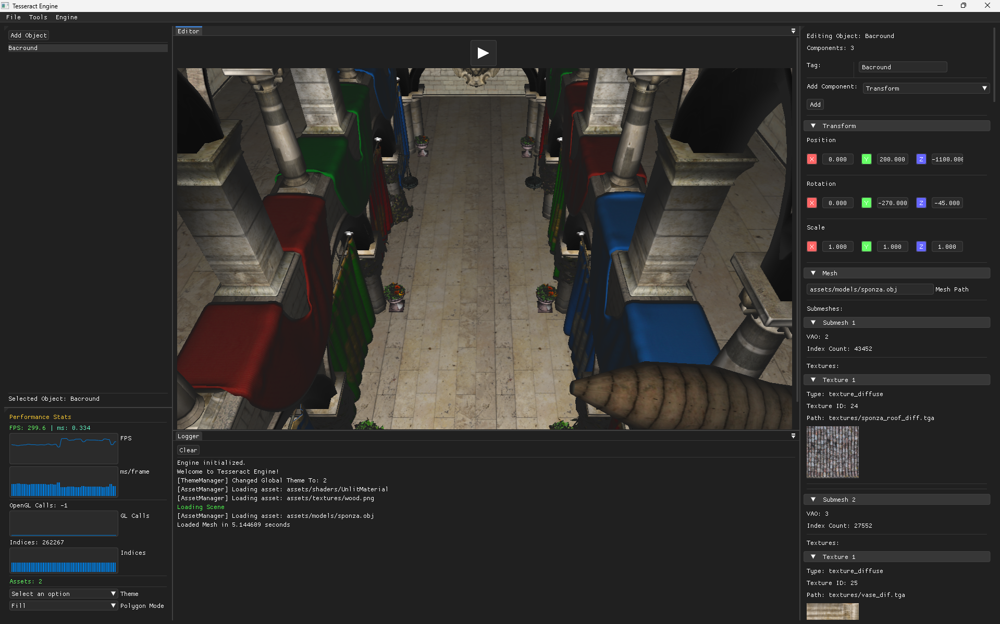

# Tesseract-Engine

**A 3D Game Engine for Small to Medium-sized Games**

   

Tesseract-Engine is a lightweight and powerful game engine designed for developers working on small to medium-sized projects. With a simple and visually appealing interface, it offers a LUA scripting environment and is built in C++ for optimal performance.

---

## Features
- **User-Friendly Interface**: Simplifies the game development process.
- **Lua Scripting Support**: Integrates Lua for customizable and flexible scripting.
- **Engine Tools**: Includes utilities like a profiler and playback system.
- **High Compatibility**: Supports various asset formats, including OBJ files and dynamic textures.

---

## Tools and Libraries Used

- [ImGui](https://github.com/ocornut/imgui): For UI creation.
- [GCML](https://dock-it.dev/GigabiteStudios/gcml): General C Macros Library
- [DLL-Extractor](https://dock-it.dev/Bit-By-Byte/DLL-Extractor): For managing and extracting DLL dependencies.

---

## Development History

### Note: Screenshots are sorted by version.


### **Version 0.0.93**
**Updates:**
- Added support for OBJ Files with MTL Textures
- Optimised OBJ Importer
- Added `Engine.Expose("var name", <local var>)`
    - This Exposes a variable to the editor GUI
- Made the LUA Engine be a `require("engine")`
- Remade Profiler to be more readable

**Screenshot:**



### **Version 0.0.76**
**Updates:**
- **Engine Profiler**: Visualize frame resource usage for optimization.
- **Playback System**: Start and pause gameplay with automatic scene saving and restoration.
- **Lua Math Library**: Includes `math.lua` for advanced calculations.
    ```lua
    local Math = require("math")
    ```
- **Temporary File Access**: Added C++ function to create temporary files.

**Screenshot:**


---

### **Version 0.0.68**
**Updates:**
- **Script Component**: Enhanced Lua scripting integration.
- **Lua Editor (WIP)**: A basic Lua script editor.
- **Lua Binding**: API for interfacing Lua with the engine.
    ```lua
    Engine.GetGameObjectByTag("")
    Component::GetComponent("")
    Engine.Log("")
    Transform:SetPosition(vec3)
    Transform:SetRotation(vec3)
    ```

**Screenshot:**


---

### **Version 0.0.50**
**Updates:**
- **Texture Preview**: Automatic texture and model loading.

**Screenshot:**


---

### **Version 0.0.45**
**Updates:**
- **OBJ File Support**: Added compatibility for OBJ asset files.

**Screenshot:**


---

### **Version 0.0.37**
**Updates:**
- **Dynamic Texture Support**: Enhanced texture management and rendering.

**Screenshot:**


---

### **Version 0.0.33**
**Screenshot:**


---

### **Version 0.0.23**
**Screenshot:**


---

### **Version 0.0.15**
**Screenshot:**


