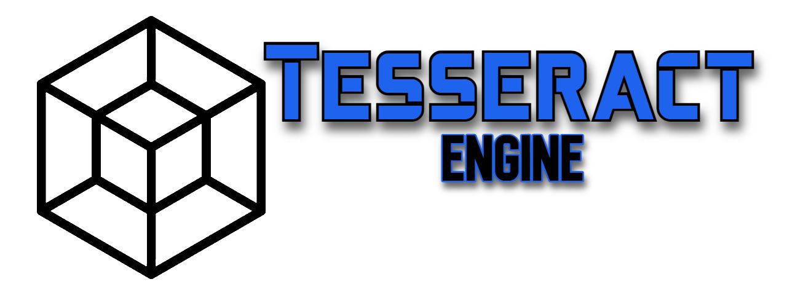
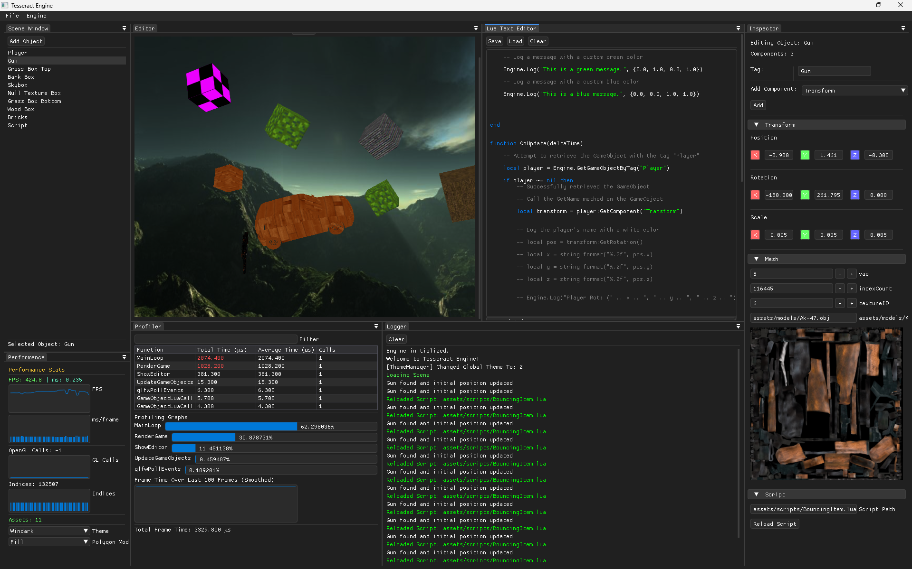
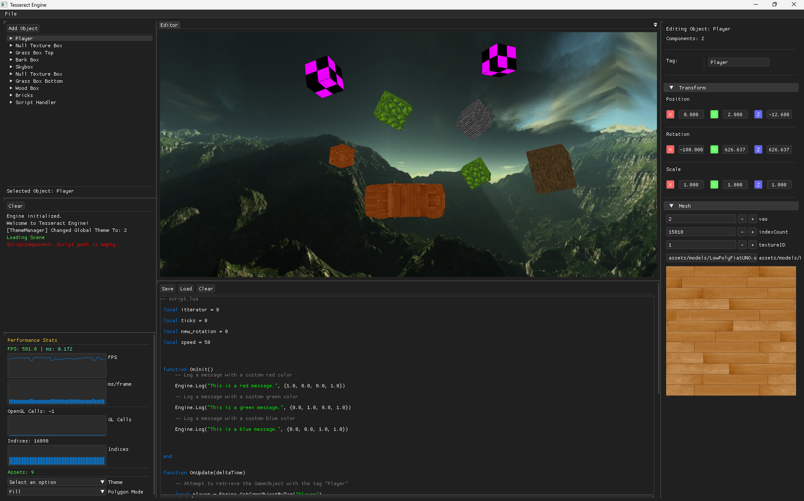
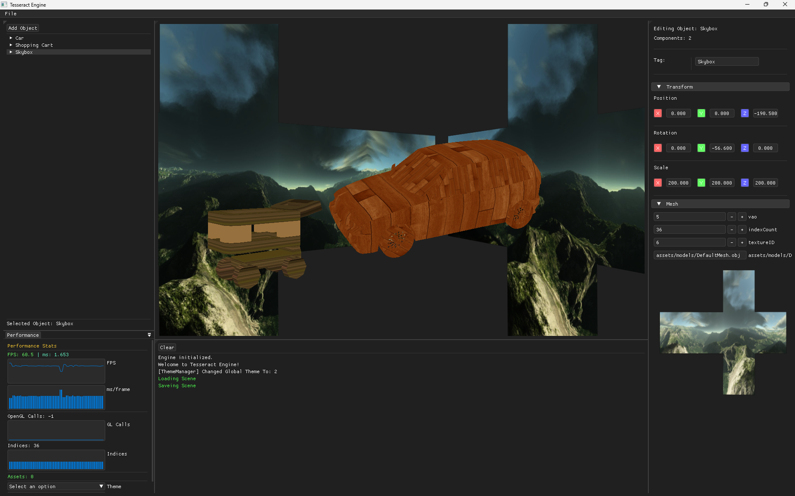
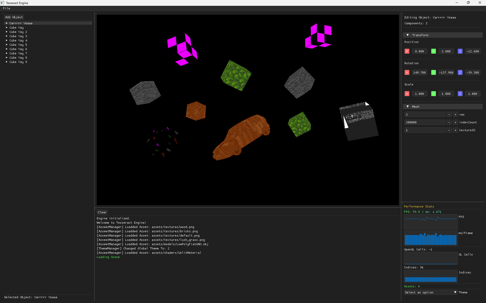

# Tesseract-Engine 

A 3D Game engine for Small to Medium-sized games with a LUA Scripting interface. written in C++ with a simple, Good looking interface. 

## Tools Used

- [ImGui](https://github.com/ocornut/imgui)
- [GCML](https://dock-it.dev/GigabiteStudios/gcml)
- [DLL-Exctractor](https://dock-it.dev/Bit-By-Byte/DLL-Extractor)

## History Of Tesseract

### Note: These screenshots are sorted by version.

#### 0.0.76
Added:
- Engine Profiler
    - a Profiler to see where your frames are going.
- Playback
    - you can now click play and pause, and it will save your current scene in a temp directory. then when you pause it will load it.
- Lua Math Library
    - math.lua
    - `local Math = require("math")`
- Temp Folder Access
    - C++ function to crate a temp file

#### 0.0.68
- Added Script Component
- Added Simple Lua editor (W.I.P)
- Added Lua Binding
    - `Engine.GetGameObjectByTag("")`
    - `Component::GetComponent(")`
    - `Engine.Log("")`
    - `Transform:SetPosition(vec3)`
    - `Transform:SetRotation(vec3)`

#### 0.0.50
- Added Texture Preview and Automatic Texture and Model Loading

#### 0.0.45
- Added support for OBJ files

#### 0.0.37
- Added Dynamic Texture suport. 

#### 0.0.33

#### 0.0.23

#### 0.0.15

