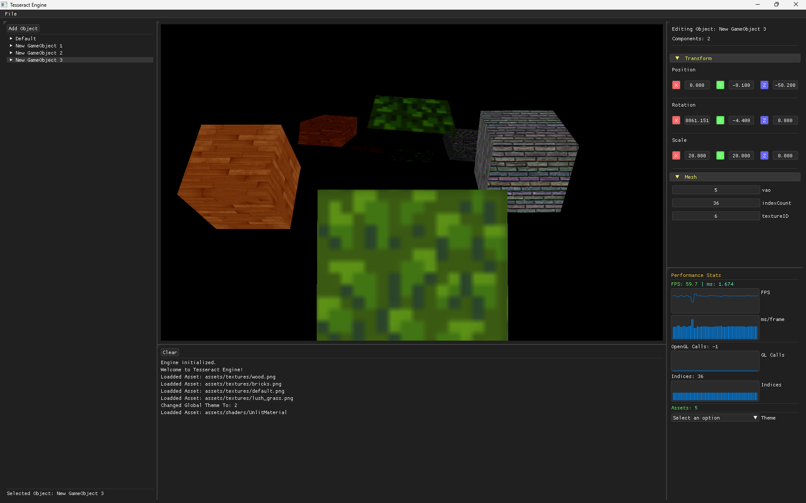
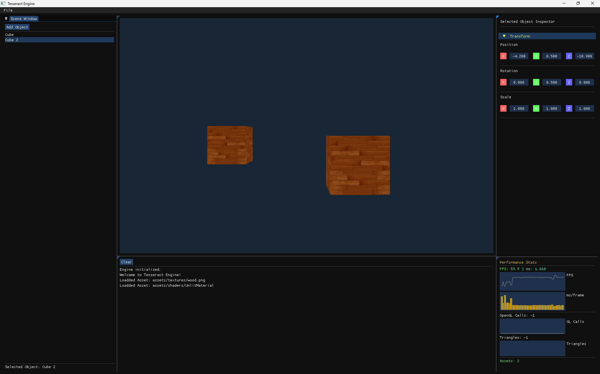
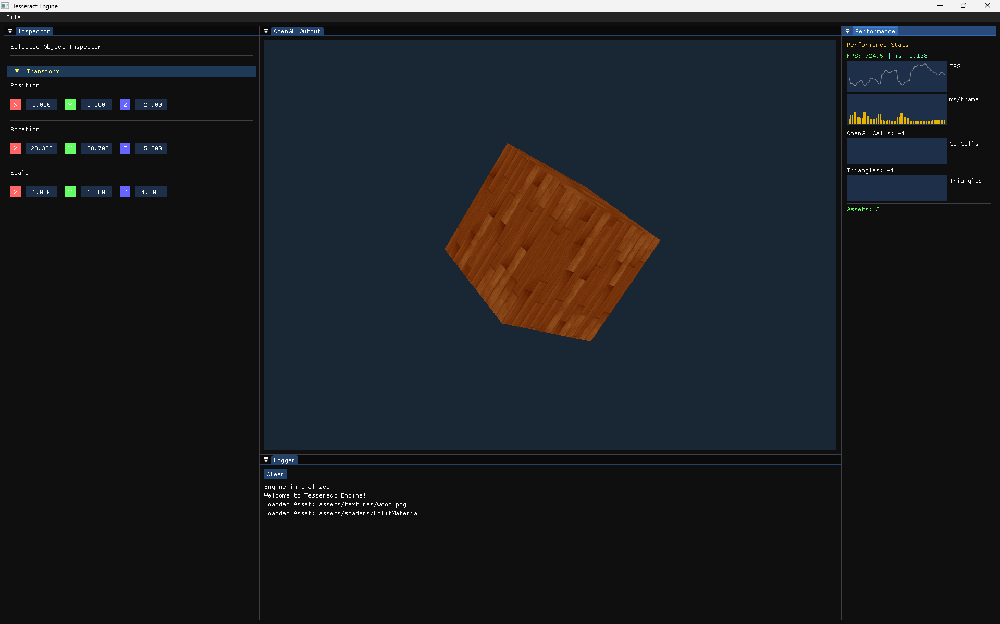
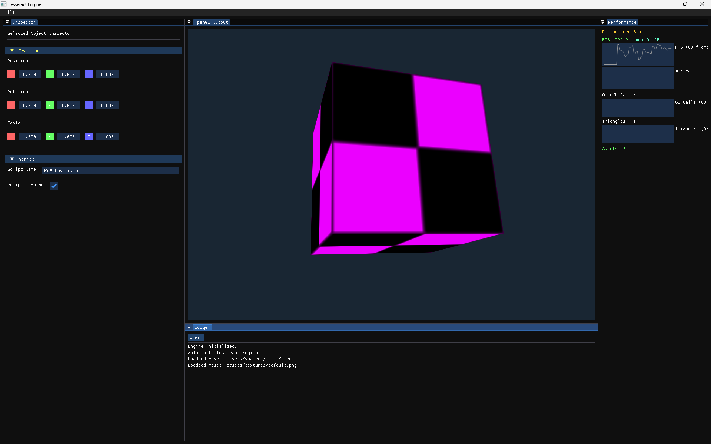

# Tesseract-Engine 

A 3D Game engine for Small to Medium-sized games with a LUA Scripting interface. written in C++ with a simple, Good looking interface. 

## History Of Tesseract

### Note: These screenshots are sorted by version.

#### 0.0.37

#### 0.0.33

#### 0.0.23

#### 0.0.15

